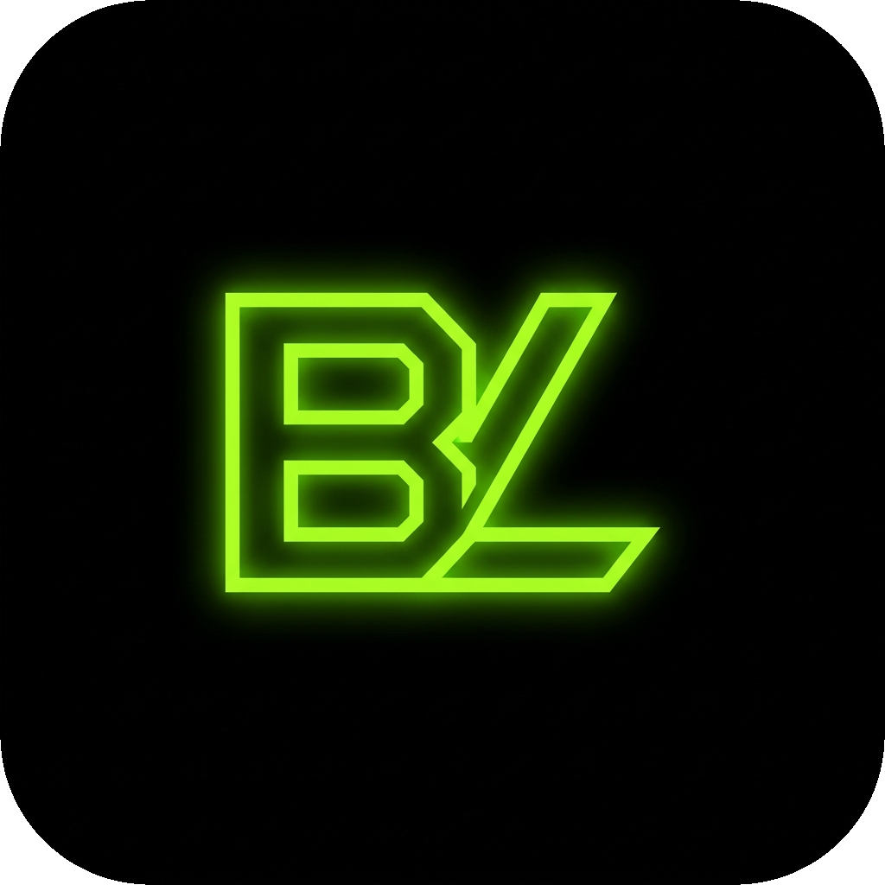
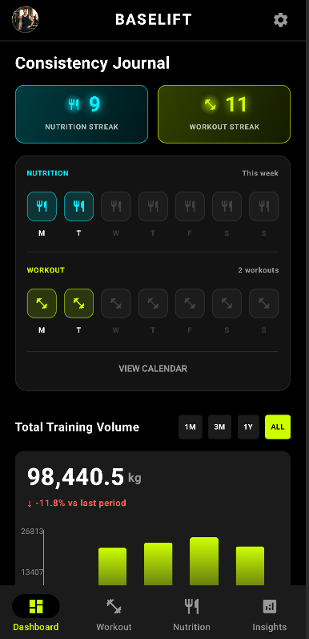
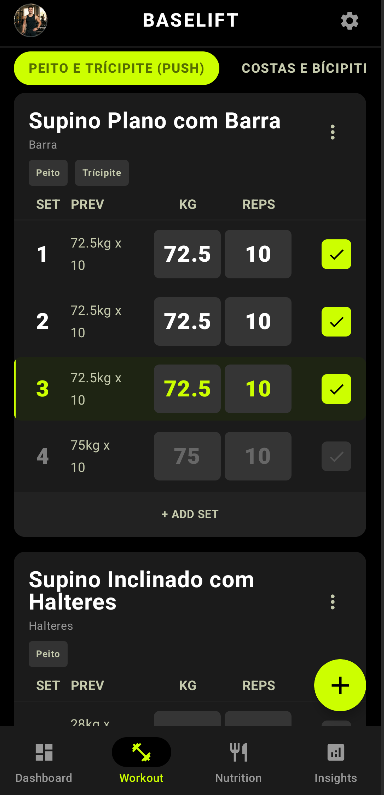
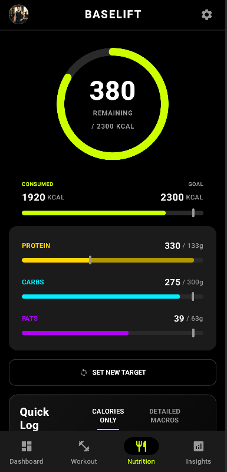
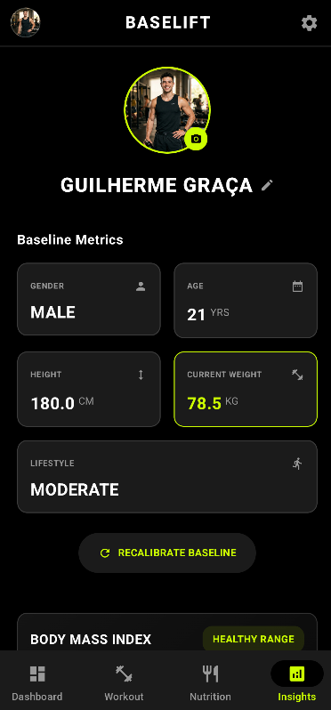

<a id="readme-top"></a>

<!-- PROJECT LOGO & HEADER -->
<br />
<div align="center">
  <a href="https://github.com/GuilhermeGraca/baselift-android">
    
  </a>
  <h3 align="center">BaseLift</h3>
  <p align="center">
    An offline-first Android fitness and nutrition tracking app built with Jetpack Compose and Room.
    <br />
    <br />
    <a href="#about-baselift"><strong>Explore the Documentation »</strong></a>
    <br />
    <br />
    <a href="https://github.com/GuilhermeGraca/baselift-android/issues">Report Bug</a>
    &middot;
    <a href="https://github.com/GuilhermeGraca/baselift-android/issues">Request Feature</a>
  </p>
</div>

---

## Demo Video

<div align="center">
  <video src="https://github.com/user-attachments/assets/00000000-0000-0000-0000-000000000000" width="600" controls></video>
  <br />
  <p align="center">
    <em>If the embedded video above is not displaying correctly, <a href="preview/videoDemoCompleto.mp4"><strong>click here to watch/download the video demo »</strong></a></em>
  </p>
</div>

> **Demo Note:** The video demonstration and screenshots below showcase the application using mock data to illustrate historical charts, workout logs, and nutrition streaks. The profile picture and physique progress photos shown in the demo are purely representative and were generated with AI.

<p align="right">(<a href="#readme-top">back to top</a>)</p>

---

## App Screenshots

<div align="center">
  <table>
    <tr>
      <td align="center">
        <br />
        <strong>Dashboard</strong><br />
        <sub>Activity overview & weekly streaks</sub>
      </td>
      <td align="center">
        <br />
        <strong>Workouts</strong><br />
        <sub>Routines & automatic PR tracking</sub>
      </td>
    </tr>
    <tr>
      <td align="center">
        <br />
        <strong>Nutrition</strong><br />
        <sub>Calories & macro breakdown</sub>
      </td>
      <td align="center">
        <br />
        <strong>Insights</strong><br />
        <sub>Weight charts & photo diary</sub>
      </td>
    </tr>
  </table>
</div>

<p align="center" style="font-size: 0.9em; color: #666;">
  <em>Note: The screenshots above highlight the core navigation screens. For additional previews showing detailed exercise breakdowns, custom Canvas charts, and the visual physique diary, explore the <a href="preview/"><strong>preview/</strong></a> directory.</em>
</p>

<p align="right">(<a href="#readme-top">back to top</a>)</p>

---

## About BaseLift

BaseLift is an all-in-one mobile application designed to centralize workout tracking, nutritional journaling, and body metric analytics into a single clean interface. Many fitness apps force users into paid subscriptions, require constant internet connectivity, or separate training logs from nutrition tracking. BaseLift solves this by offering a completely offline, privacy-focused experience where all data stays on your device.

> **Note:** Conceived and developed as a personal project, BaseLift was also presented as the final evaluation project for the Mobile Applications Development (DAM) course at ISEL — Instituto Superior de Engenharia de Lisboa, and continues to be actively developed.

### Built With

* [](https://kotlinlang.org/)
* [](https://developer.android.com/jetpack/compose)
* [](https://developer.android.com/studio)
* [](https://developer.android.com/training/data-storage/room)

<p align="right">(<a href="#readme-top">back to top</a>)</p>

---

## Key Features

* **100% Offline Storage**: All biometric data, workout sessions, and nutrition logs are saved locally using Room SQLite, ensuring instant load times and complete privacy.
* **Unified Fitness & Macro Hub**: Track daily calories, protein, carbs, and fats alongside customized gym workout routines without switching between different apps.
* **Automatic PR Detection**: Analyzes logged workout sets to automatically detect and highlight Personal Records for maximum weight and estimated 1RM.
* **Interactive Canvas Charts**: Custom-built weight progress charts and daily macro breakdown bars rendered directly in Jetpack Compose without external charting libraries.
* **Smart Target Recalibration**: Automatically recalculates daily calorie and macronutrient goals whenever you update your weight or fitness objective.
* **Physique Photo Journal**: Record visual progress photos alongside your weight entries, complete with gesture zoom support.
* **Weekly Streaks & Activity Calendar**: Monitor your consistency with dedicated training and nutrition streaks and a unified historical calendar on the main dashboard.

<p align="right">(<a href="#readme-top">back to top</a>)</p>

---

## Technical Highlights & Lessons Learned

* **Modern Android Architecture**: Built using the MVVM pattern with a clean Repository abstraction to isolate local database operations from the UI layer.
* **Reactive State Management**: Implemented declarative UI flows in Jetpack Compose driven by Kotlin Coroutines, Flow, and StateFlow.
* **Comprehensive Testing Suite**: Built over 70 unit and integration tests covering pure domain logic, Room DAOs, ViewModels (via Fake Repositories for ultra-fast JVM execution), and MockK for isolated complex rules (e.g., PR calculation).
* **AI-Assisted Test Automation**: The testing suite was extensively authored with AI assistance. This served as a profound lesson in modern development: delegating repetitive test creation to AI is one of its most powerful use cases, guaranteeing massive edge-case coverage, enforcing strict logical patterns, and dramatically increasing development speed.
* **Relational SQLite Schema**: Designed custom Room database entities, foreign key relationships, and migration paths for workouts, exercises, sets, and nutrition logs.
* **Custom Graphics Rendering**: Developed interactive charts and progress visualizations from scratch using Jetpack Compose Canvas.
* **User Experience Planning**: Designed an intuitive onboarding flow, clear navigation, and responsive layouts tailored for daily gym use.

<p align="right">(<a href="#readme-top">back to top</a>)</p>

---

## Getting Started

Follow these steps to run a local copy of BaseLift on your machine.

### Prerequisites

* **Android Studio**: Hedgehog or newer
* **Java Development Kit (JDK)**: **JDK 17 or higher** (e.g., Amazon Corretto 17, Eclipse Temurin 17, or Android Studio Embedded JDK 17+)
* **Android SDK**: API level 35 support

### Installation & Running Locally

1. **Clone the repository**:
   ```sh
   git clone https://github.com/GuilhermeGraca/baselift-android.git
   ```
2. **Open the project in Android Studio**:
   * Open Android Studio and select **Open an Existing Project**.
   * Choose the cloned `baselift-android` directory.
   * **Note on Gradle JDK**: If Gradle sync fails with a Java version error, go to **Settings/Preferences > Build, Execution, Deployment > Build Tools > Gradle** and ensure the **Gradle JDK** is set to **JDK 17 or higher** (such as Amazon Corretto 17 or JetBrains Runtime 17).
3. **Run the application**:
   * Allow Gradle to finish syncing the project dependencies.
   * Select an emulator or physical device running Android 7.0 (API level 24) or higher.
   * Click **Run**. No API keys or external server configurations are required.

<p align="right">(<a href="#readme-top">back to top</a>)</p>

---

## Usage

* **Onboarding**: Create your user profile by entering your age, gender, height, weight, activity level, and fitness goal to calculate daily calories and macros.
* **Workout Logging**: Create custom routines, add exercises, and record sets, repetitions, and weight during your training session.
* **Nutrition Tracking**: Log meals manually or use pre-configured meal templates to track daily calories and macronutrient intake.
* **Progress Insights**: Check the Insights screen to review your weight progression chart and photo journal over time.

<p align="right">(<a href="#readme-top">back to top</a>)</p>

---

## Contact

Guilherme Graça
* **LinkedIn**: [guilherme-graça](https://www.linkedin.com/in/guilherme-gra%C3%A7a-653153351/)
* **GitHub**: [@GuilhermeGraca](https://github.com/GuilhermeGraca)
* **Project Link**: [https://github.com/GuilhermeGraca/baselift-android](https://github.com/GuilhermeGraca/baselift-android)

<p align="right">(<a href="#readme-top">back to top</a>)</p>

---

## Acknowledgments

* **ISEL — Instituto Superior de Engenharia de Lisboa**: For institutional support and academic environment.
* **Mobile Applications Development (DAM) Course**: For the technical foundation that supported the development of this project.

<p align="right">(<a href="#readme-top">back to top</a>)</p>
