<a id="readme-top"></a>

<!-- PROJECT SHIELDS -->
[![Contributors][contributors-shield]][contributors-url]
[![Forks][forks-shield]][forks-url]
[![Stargazers][stars-shield]][stars-url]
[![Issues][issues-shield]][issues-url]
[![project_license][license-shield]][license-url]
[![LinkedIn][linkedin-shield]][linkedin-url]

<!-- PROJECT LOGO & HEADER -->
<br />
<div align="center">
  <a href="https://github.com/GuilhermeGraca/baselift-android">
    
  </a>
  <h3 align="center">BaseLift</h3>
  <p align="center">
    An offline-first Android fitness and nutrition tracking app built with Jetpack Compose and Room.
    <br />
    <br />
    <a href="#about-baselift"><strong>Explore the Documentation »</strong></a>
    <br />
    <br />
    <a href="https://github.com/GuilhermeGraca/baselift-android/issues">Report Bug</a>
    &middot;
    <a href="https://github.com/GuilhermeGraca/baselift-android/issues">Request Feature</a>
  </p>
</div>

---

## Demo Video

<div align="center">
  

https://github.com/user-attachments/assets/aed02c03-2595-4cf2-b8ba-0e3d4a788ece


  <br />
  <p align="center">
    <em>If the embedded video above is not displaying correctly, <a href="preview/videoDemoCompleto.mp4"><strong>click here to watch/download the video demo »</strong></a></em>
  </p>
</div>

> **Demo Note:** The video demonstration and screenshots below showcase the application using mock data to illustrate historical charts, workout logs, and nutrition streaks. The profile picture and physique progress photos shown in the demo are purely representative and were generated with AI.

<p align="right">(<a href="#readme-top">back to top</a>)</p>

---

## About BaseLift

*A minimalist, offline-first fitness tracker built by a lifter, for lifters.*

BaseLift centralizes workout tracking, nutrition journaling, and body metric analytics into a single private interface. All data stays securely on your device—no cloud sync, no accounts, no subscriptions. Designed as a distraction-free utility, it features a premium dark-mode aesthetic with satisfying micro-interactions.

> **Note:** Developed as a personal project and final evaluation for the Mobile Applications Development (DAM) course at ISEL (Instituto Superior de Engenharia de Lisboa).

### Onboarding & Setup
Intuitive flow to establish baseline metrics and custom macronutrient targets.

<div align="center">
  <table>
    <tr>
      <td align="center">
        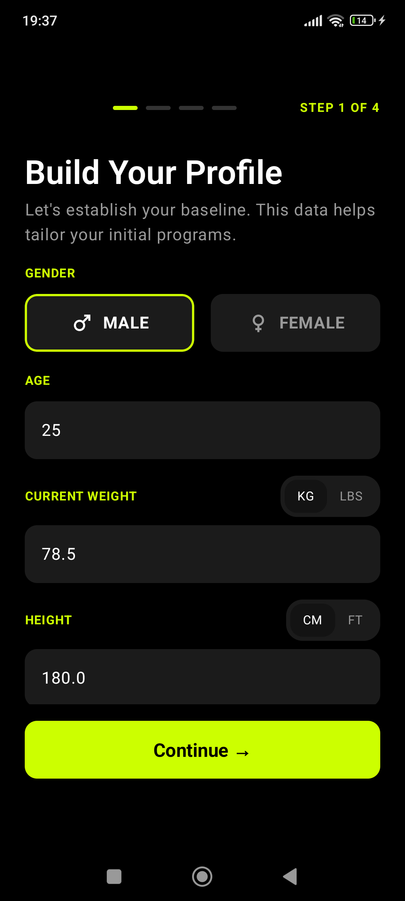<br />
        <sub>Profile Creation</sub>
      </td>
      <td align="center">
        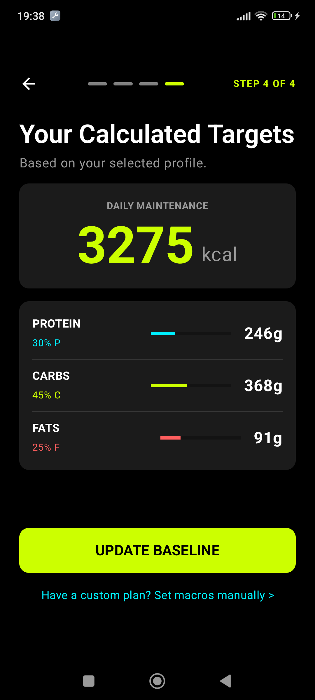<br />
        <sub>Auto-Calculated Targets</sub>
      </td>
      <td align="center">
        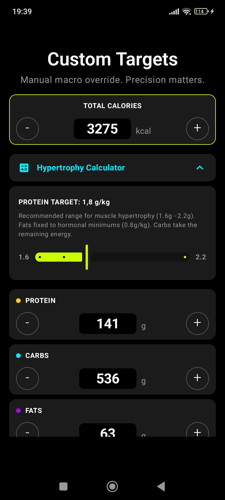<br />
        <sub>Custom Macro Overrides</sub>
      </td>
    </tr>
  </table>
</div>

### Insights & Visual Diary
Visualize weight trends and track physique evolution with a private photo diary. Includes health metric calculators.

<div align="center">
  <table>
    <tr>
      <td align="center">
        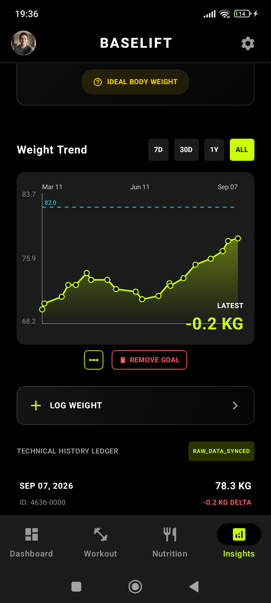<br />
        <sub>Interactive Weight Chart</sub>
      </td>
      <td align="center">
        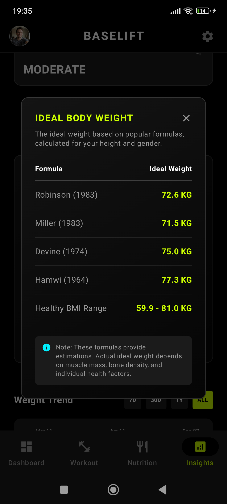<br />
        <sub>Ideal Weight Calculator</sub>
      </td>
      <td align="center">
        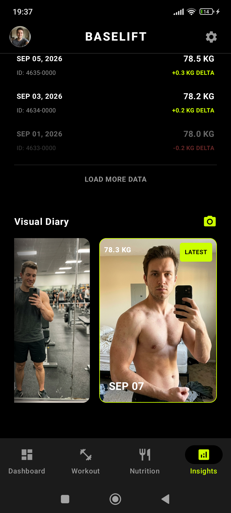<br />
        <sub>Private Photo Journal</sub>
      </td>
    </tr>
  </table>
</div>

### Nutrition Tracking
Effortless logging. Track detailed macros or use the Quick Add feature. Targets automatically recalibrate as your body weight changes.

<div align="center">
  <table>
    <tr>
      <td align="center">
        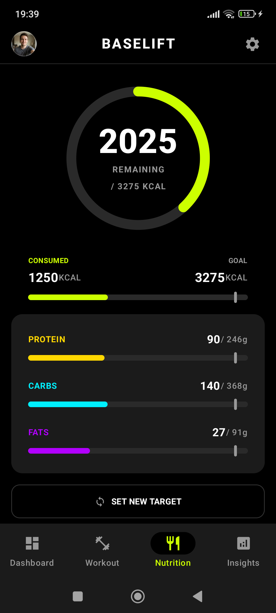<br />
        <sub>Daily Macro Breakdown</sub>
      </td>
      <td align="center">
        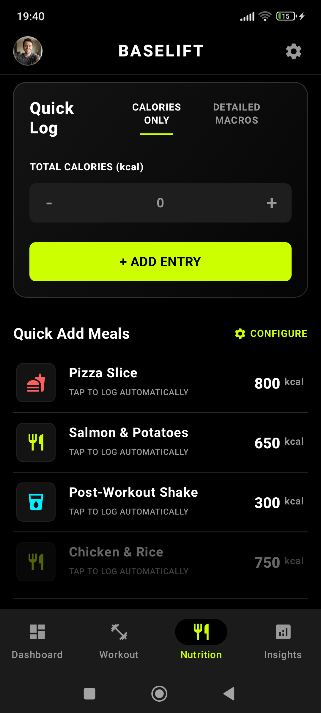<br />
        <sub>Quick Add Meals</sub>
      </td>
      <td align="center">
        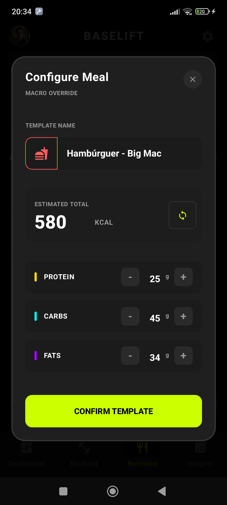<br />
        <sub>Configure Meal Template</sub>
      </td>
    </tr>
  </table>
</div>

### Workouts & Training
Ultimate customization for exercises. Enjoy seamless progressive overload with previous set data displayed inline, custom rest timers, and drag-and-drop reordering.

<div align="center">
  <table>
    <tr>
      <td align="center">
        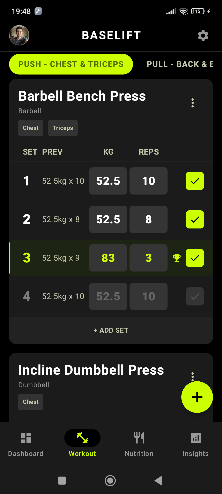<br />
        <sub>Active Workout Logging</sub>
      </td>
      <td align="center">
        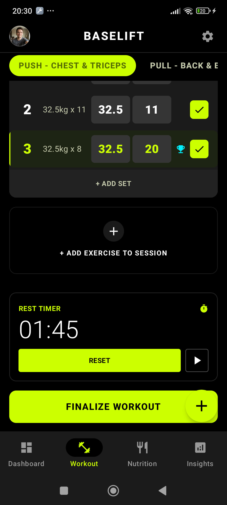<br />
        <sub>Custom Rest Timers</sub>
      </td>
      <td align="center">
        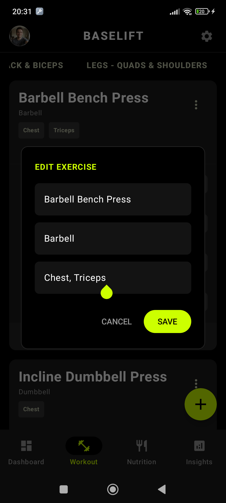<br />
        <sub>Edit Custom Exercises</sub>
      </td>
    </tr>
  </table>
</div>

### Dashboard & Analytics
Monitor consistency with visual streaks, activity calendars, and granular volume tracking for routines and specific exercises.

<div align="center">
  <table>
    <tr>
      <td align="center">
        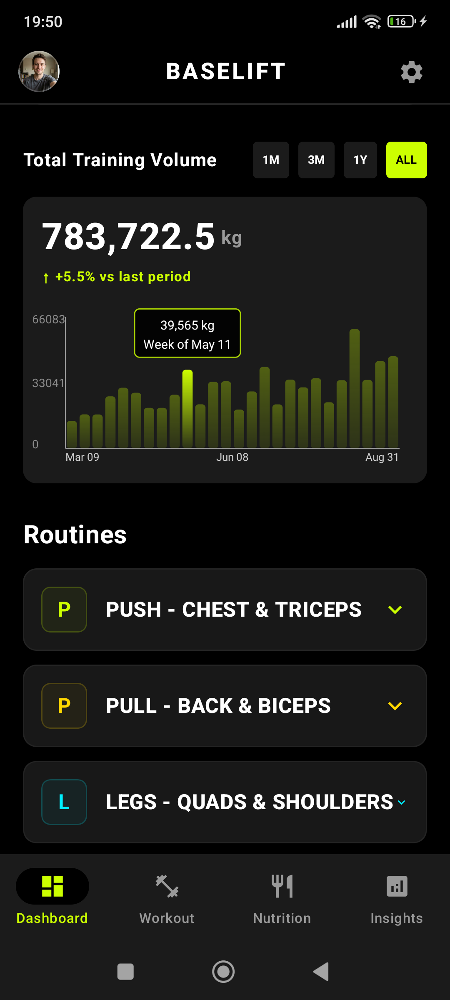<br />
        <sub>Total Training Volume</sub>
      </td>
      <td align="center">
        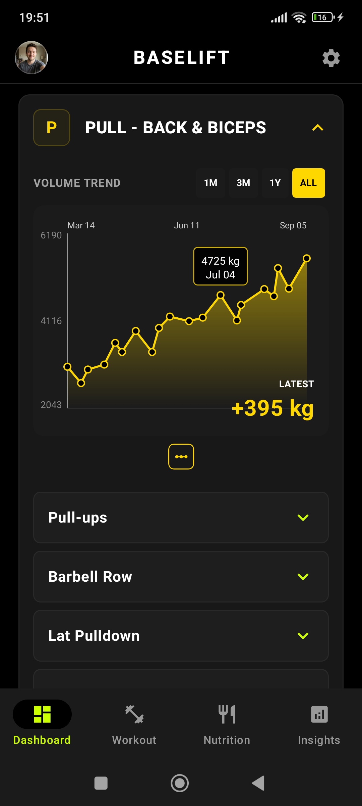<br />
        <sub>Routine Progression</sub>
      </td>
      <td align="center">
        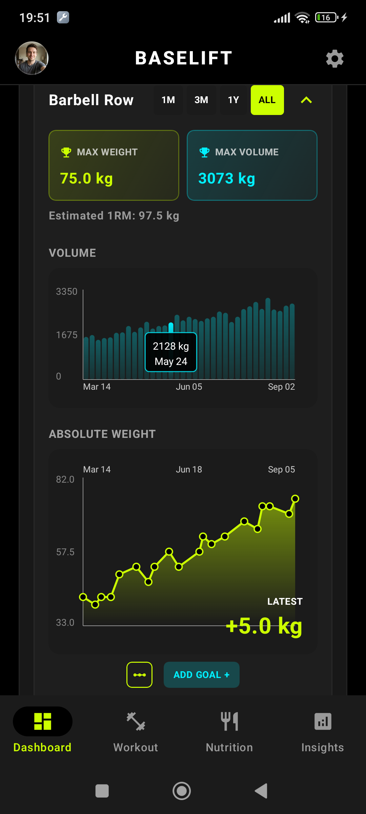<br />
        <sub>Granular Exercise Details</sub>
      </td>
    </tr>
  </table>
</div>

#### Background Reminders
<table>
  <tr>
    <td width="50%" valign="top">
      <b>BaseLift safely tracks your ongoing session in the background.</b>
      <br><br>
      <ul>
        <li><b>Smart Notifications:</b> If you leave the app or lock your phone with an active session, it issues a timely reminder.</li>
        <li><b>Protect Your Streaks:</b> Prevents you from forgetting to hit <i>"Finalize Workout"</i>, ensuring your effort is always logged and your weekly streaks are never lost.</li>
        <li><b>Data Accuracy:</b> Keeps your total training duration and analytics perfectly precise.</li>
      </ul>
    </td>
    <td width="50%" align="center">
      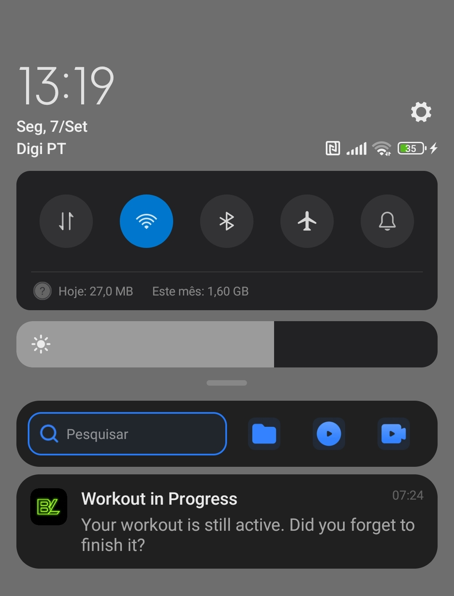<br />
      <sub>Smart Active Workout Reminder</sub>
    </td>
  </tr>
</table>

### Built With

* [](https://kotlinlang.org/)
* [](https://developer.android.com/jetpack/compose)
* [](https://developer.android.com/studio)
* [](https://developer.android.com/training/data-storage/room)

<p align="right">(<a href="#readme-top">back to top</a>)</p>

---

## Key Features

* **100% Offline & Private**: Data is saved locally using Room SQLite. Instant load times, no internet required.
* **Unified Hub**: Track calories, macros, and customized gym routines in one place.
* **Seamless Progressive Overload**: Previous workout performance is displayed directly inside the current set row.
* **Automatic PR Detection**: Highlights Personal Records for maximum weight and estimated 1RM.
* **Interactive Canvas Charts**: Custom-built charts rendered directly in Jetpack Compose without external libraries.
* **Smart Target Recalibration**: Automatically adjusts daily calorie and macronutrient goals based on weight updates.
* **Private Physique Journal**: Progress photos with gesture zoom, kept separate from your phone's main camera roll.
* **Consistency Tracking**: Weekly streaks and a unified historical calendar.
* **Premium UX**: Haptic feedback, custom swipe-to-delete gestures, and fluid animations.

<p align="right">(<a href="#readme-top">back to top</a>)</p>

---

## Technical Highlights & Lessons Learned

* **Modern Android Architecture**: Built using the MVVM pattern with a clean Repository abstraction to isolate local database operations from the UI layer.
* **Reactive State Management**: Implemented declarative UI flows in Jetpack Compose driven by Kotlin Coroutines, Flow, and StateFlow.
* **Comprehensive Testing Suite**: Built over 70 unit and integration tests covering pure domain logic, Room DAOs, ViewModels (via Fake Repositories for ultra-fast JVM execution), and MockK for isolated complex rules (e.g., PR calculation).
* **AI-Assisted Test Automation**: The testing suite was extensively authored with AI assistance. This served as a lesson in modern development: delegating repetitive test creation to AI is one of its most powerful use cases, guaranteeing massive edge-case coverage, enforcing strict logical patterns, and dramatically increasing development speed.
* **Relational SQLite Schema**: Designed custom Room database entities, foreign key relationships, and migration paths for workouts, exercises, sets, and nutrition logs.
* **Custom Graphics Rendering**: Developed interactive charts and progress visualizations from scratch using Jetpack Compose Canvas.
* **User Experience Planning**: Designed an intuitive onboarding flow, clear navigation, and responsive layouts tailored for daily gym use.

<p align="right">(<a href="#readme-top">back to top</a>)</p>

---

## Getting Started

Follow these steps to run a local copy of BaseLift on your machine.

### Prerequisites

* **Android Studio**: Hedgehog or newer
* **Java Development Kit (JDK)**: **JDK 17 or higher** (e.g., Amazon Corretto 17, Eclipse Temurin 17, or Android Studio Embedded JDK 17+)
* **Android SDK**: API level 35 support

### Installation & Running Locally

1. **Clone the repository**:
   ```sh
   git clone https://github.com/GuilhermeGraca/baselift-android.git
   ```
2. **Open the project in Android Studio**:
   * Open Android Studio and select **Open an Existing Project**.
   * Choose the cloned `baselift-android` directory.
   * **Note on Gradle JDK**: If Gradle sync fails with a Java version error, go to **Settings/Preferences > Build, Execution, Deployment > Build Tools > Gradle** and ensure the **Gradle JDK** is set to **JDK 17 or higher** (such as Amazon Corretto 17 or JetBrains Runtime 17).
3. **Run the application**:
   * Allow Gradle to finish syncing the project dependencies.
   * Select an emulator or physical device running Android 7.0 (API level 24) or higher.
   * Click **Run**. No API keys or external server configurations are required.

<p align="right">(<a href="#readme-top">back to top</a>)</p>

---

## Usage

* **Onboarding**: Create your user profile by entering your age, gender, height, weight, activity level, and fitness goal to calculate daily calories and macros.
* **Workout Logging**: Create custom routines, add exercises, and record sets, repetitions, and weight during your training session.
* **Nutrition Tracking**: Log meals manually or use pre-configured meal templates to track daily calories and macronutrient intake.
* **Progress Insights**: Check the Insights screen to review your weight progression chart and photo journal over time.

<p align="right">(<a href="#readme-top">back to top</a>)</p>

---

## Contact

Guilherme Graça
* **LinkedIn**: [guilherme-graça](https://www.linkedin.com/in/guilherme-gra%C3%A7a-653153351/)
* **GitHub**: [@GuilhermeGraca](https://github.com/GuilhermeGraca)
* **Project Link**: [https://github.com/GuilhermeGraca/baselift-android](https://github.com/GuilhermeGraca/baselift-android)

<p align="right">(<a href="#readme-top">back to top</a>)</p>

---

## Acknowledgments

* **ISEL — Instituto Superior de Engenharia de Lisboa**: For institutional support and academic environment.
* **Mobile Applications Development (DAM) Course**: For the technical foundation that supported the development of this project.

<p align="right">(<a href="#readme-top">back to top</a>)</p>

<!-- MARKDOWN LINKS & IMAGES -->
<!-- https://www.markdownguide.org/basic-syntax/#reference-style-links -->
[contributors-shield]: https://img.shields.io/github/contributors/GuilhermeGraca/baselift-android.svg?style=for-the-badge
[contributors-url]: https://github.com/GuilhermeGraca/baselift-android/graphs/contributors
[forks-shield]: https://img.shields.io/github/forks/GuilhermeGraca/baselift-android.svg?style=for-the-badge
[forks-url]: https://github.com/GuilhermeGraca/baselift-android/network/members
[stars-shield]: https://img.shields.io/github/stars/GuilhermeGraca/baselift-android.svg?style=for-the-badge
[stars-url]: https://github.com/GuilhermeGraca/baselift-android/stargazers
[issues-shield]: https://img.shields.io/github/issues/GuilhermeGraca/baselift-android.svg?style=for-the-badge
[issues-url]: https://github.com/GuilhermeGraca/baselift-android/issues
[license-shield]: https://img.shields.io/badge/License-Personal%20Use%20Only-blue.svg?style=for-the-badge
[license-url]: https://github.com/GuilhermeGraca/baselift-android/blob/main/LICENSE
[linkedin-shield]: https://img.shields.io/badge/-LinkedIn-black.svg?style=for-the-badge&logo=linkedin&colorB=555
[linkedin-url]: https://www.linkedin.com/in/guilherme-graça-653153351/
